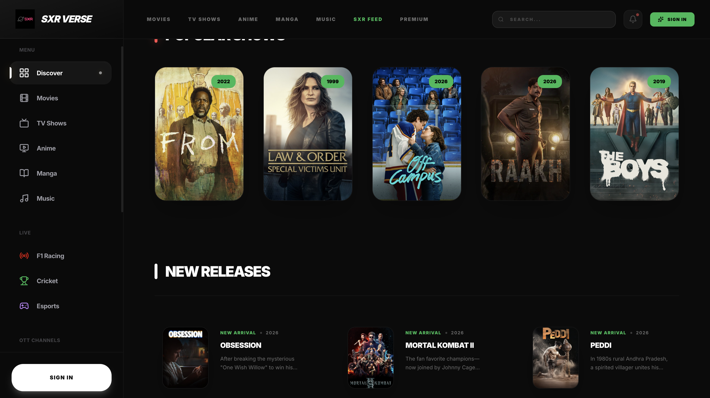
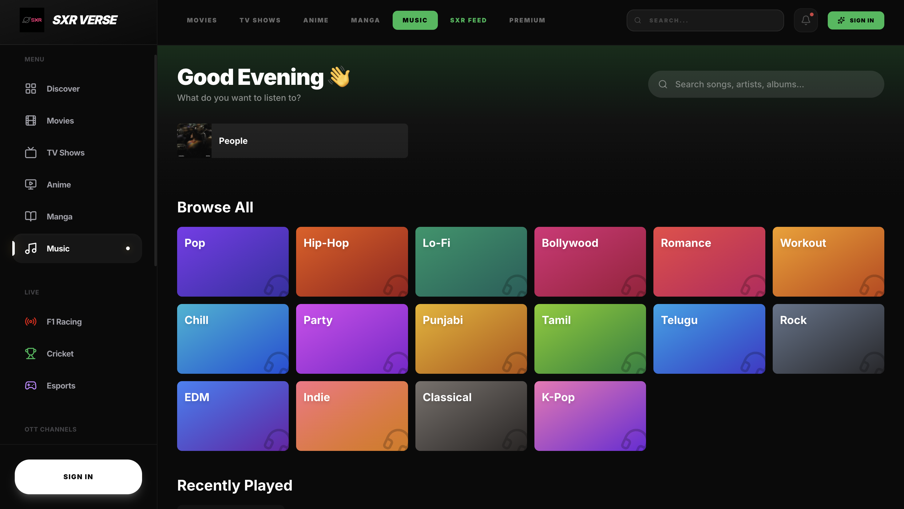

# SXRverse - Cineb

A modern, dynamic web application providing a rich user experience for movies, channels, and music.

## 📸 Screenshots


*Explore our dynamic home page with featured content.*


*Seamlessly browse through movies and live channels.*


*Enjoy an integrated music playback experience.*

## ✨ Features
- **Movie Browsing**: Explore a wide range of movies.
- **Live Channels**: Watch live channels directly on the platform.
- **Music Player**: Listen to music with a built-in music player.
- **Responsive Design**: Beautiful interface tailored for both desktop and mobile devices.

## 🚀 Getting Started

### Prerequisites
Make sure you have [Node.js](https://nodejs.org/) installed on your machine.

### Installation

1. Clone the repository:
   ```bash
   git clone https://github.com/sainath24-dev/SXRverse.git
   ```

2. Navigate into the project directory:
   ```bash
   cd SXRverse/cineb
   ```

3. Install dependencies:
   ```bash
   npm install
   ```

4. Set up your environment variables:
   - Create a `.env` file in the `cineb` folder.
   - Copy the contents of `.env.example` (or set `VITE_API_URL` and `VITE_BACKEND_URL`).

5. Start the development server:
   ```bash
   npm run dev
   ```

## 🛠 Tech Stack
- React / Vite
- Tailwind CSS (or standard CSS)
- Node.js (Backend)

---
*Feel free to update this README as the project grows!*
